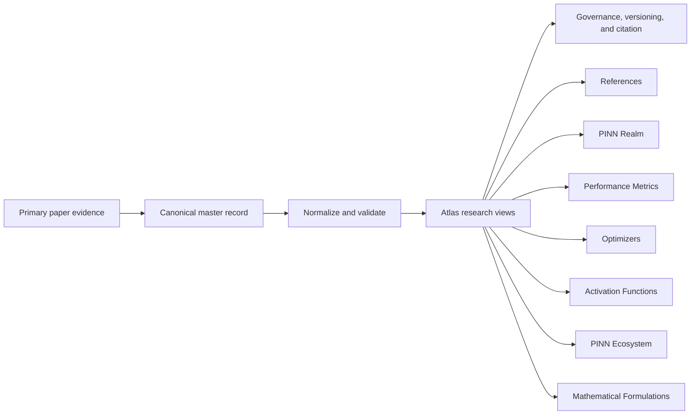

<p align="center">
  
</p>

<h1 align="center">PINN Review Atlas</h1>

<p align="center">
  <strong>An evidence-led interactive research atlas for Physics-Informed Neural Networks</strong><br>
  Explore a curated PINN evidence corpus, mathematical formulations, methods, evaluation practice, research geography, terminology, resources, and transparent data governance from one connected public system.
</p>

<p align="center">
  <a href="https://ahafuaej-alt.github.io/PINN-Review/"></a>
  <a href="https://ahafuaej-alt.github.io/PINN-Review/references/"></a>
</p>

<p align="center">
  <a href="https://ahafuaej-alt.github.io/PINN-Review/pinn-ecosystem/">PINN Ecosystem</a> ·
  <a href="https://ahafuaej-alt.github.io/PINN-Review/mathematical-formulations/">Mathematical Formulations</a> ·
  <a href="https://ahafuaej-alt.github.io/PINN-Review/references/">References</a> ·
  <a href="https://ahafuaej-alt.github.io/PINN-Review/pinn-realm/">PINN Realm</a> ·
  <a href="https://ahafuaej-alt.github.io/PINN-Review/performance-metrics/">Performance Metrics</a> ·
  <a href="https://ahafuaej-alt.github.io/PINN-Review/cite/">Cite</a>
</p>

---

## About the Atlas

**PINN Review Atlas** is a public research system for inspecting and synthesizing evidence about Physics-Informed Neural Networks. Its interfaces are connected to canonical or explicitly derived datasets so that a visual summary can be traced back to paper-level evidence, normalized records, or a documented Atlas taxonomy.

The Atlas is designed to answer questions such as:

- Which PINN methods, optimizers, activation functions, mathematical formulations, and evaluation metrics are represented in the evidence base?
- Which papers support a particular formulation, methodological element, classification, or terminology record?
- How is PINN research distributed geographically and where does international collaboration occur?
- How complete is performance reporting across the evidence corpus?
- How do PINN elements interact as one coupled numerical-learning system?
- Which public record, dataset, or Atlas version supports a particular visual result?

The governing principle is simple: **the interface may evolve, but the evidence trail must remain inspectable.**

## Atlas navigation

The public navigation is organized around one featured system and six research families.

### PINN Ecosystem

| Module | Status | What it provides |
|---|---|---|
| **[PINN Ecosystem & Design Studio](https://ahafuaej-alt.github.io/PINN-Review/pinn-ecosystem/)** | **Live** | Nine dependent PINN design layers, 35 methodological groups, explicit relationships, an interactive builder, compatibility signals, architecture flow, SVG export, shareable configurations, and edit proposals. |

### Methods & Evaluation

| Module | Status | What it provides |
|---|---|---|
| **[Architectures](https://ahafuaej-alt.github.io/PINN-Review/architectures/)** | **Prepared workspace** | Stable architecture for a validated network-design evidence view. |
| **[Activation Functions](https://ahafuaej-alt.github.io/PINN-Review/activation-functions/)** | **Live** | Activation-function evidence, normalized families, adaptive variants, layer roles, source context, and reporting coverage. |
| **[Training](https://ahafuaej-alt.github.io/PINN-Review/training/)** | **Prepared workspace** | Stable structure for loss design, sampling, initialization, learning-rate, and training-workflow evidence. |
| **[Optimizers](https://ahafuaej-alt.github.io/PINN-Review/optimizers/)** | **Live** | Paper-level optimizer and training/inference-algorithm evidence with conservative normalization, families, prevalence views, and comparison tools. |
| **[Performance Metrics](https://ahafuaej-alt.github.io/PINN-Review/performance-metrics/)** | **Live** | Paper-level reporting of accuracy, physics, robustness, efficiency, uncertainty, and related measures using a 123-metric taxonomy. |

### Foundations & Terminology

| Module | Status | What it provides |
|---|---|---|
| **[Mathematical Formulations](https://ahafuaej-alt.github.io/PINN-Review/mathematical-formulations/)** | **Live** | Searchable catalogue of 114 formulation records with unified notation, Direct/Equivalent/Synthesized evidence labels, 154 unique Atlas evidence references, a nine-stage interactive workflow, and public edit proposals. |
| **[PINN Types](https://ahafuaej-alt.github.io/PINN-Review/pinn-types/)** | **Prepared workspace** | Classification, family, alias, frequency, profile, and evidence routes prepared for validated PINN-type records. |
| **[Abbreviations](https://ahafuaej-alt.github.io/PINN-Review/abbreviations/)** | **Live** | Reported PINN-related abbreviations, frequencies, and traceability to supporting reference IDs. |

### Research Landscape

| Module | Status | What it provides |
|---|---|---|
| **[PINN Realm](https://ahafuaej-alt.github.io/PINN-Review/pinn-realm/)** | **Live** | Geographic analysis of the 853-paper corpus, annual publication profiles, international affiliation co-occurrence, collaboration volume, and Jaccard intensity. |
| **[Applications](https://ahafuaej-alt.github.io/PINN-Review/applications/)** | **Prepared workspace** | Stable structure for validated scientific and engineering application evidence. |
| **[References](https://ahafuaej-alt.github.io/PINN-Review/references/)** | **Live** | Complete 853-record bibliography with search, filters, shareable URLs, reading lists, analytics, metadata, abstracts, and citation exports. |

### Tools & Resources

| Module | Status | What it provides |
|---|---|---|
| **[Software](https://ahafuaej-alt.github.io/PINN-Review/software/)** | **Prepared workspace** | Stable structure for PINN libraries, frameworks, solvers, and supporting software. |
| **[Datasets & Benchmarks](https://ahafuaej-alt.github.io/PINN-Review/datasets/)** | **Prepared workspace** | Stable structure for benchmark equations, datasets, and reproducibility resources. |

### Frameworks

| Module | Status | What it provides |
|---|---|---|
| **[Frameworks](https://ahafuaej-alt.github.io/PINN-Review/frameworks/)** | **Live** | Four source-faithful, structured interactive views: a ten-stage Design Stack, six-domain Co-Design systems map, complete 14 × 7 Design–Performance Matrix, and thirteen-pathway Failure-Mode Diagnostics, with verified evidence, canonical Atlas backlinks, current-state SVG export, and public contribution routes. |

### Data Governance

| Module | Status | What it provides |
|---|---|---|
| **[Dataset Manager](https://ahafuaej-alt.github.io/PINN-Review/dataset-manager/)** | **Live** | Evidence-backed correction workflow for canonical paper records with impact preview, citation generation, validation, and auditable GitHub submission. |
| **[Publisher Metadata Review](https://ahafuaej-alt.github.io/PINN-Review/dataset-manager/review/)** | **Live** | Review surface for DOI, publisher, and arXiv metadata proposals. |
| **[Reference Changelog](https://ahafuaej-alt.github.io/PINN-Review/references/changelog/)** | **Live** | Version history, provenance, correction history, and data-quality policy. |

The primary navigation also exposes **[Cite](https://ahafuaej-alt.github.io/PINN-Review/cite/)** directly. Privacy and the 404 recovery page are supporting public routes rather than primary menu destinations.

> **Status matters.** A prepared workspace is not presented as a populated evidence dataset. Live status is reserved for public views whose underlying records or curated taxonomy are available for inspection.

## Research data at a glance

The Atlas uses the numeric **paper/reference ID as the stable primary key**. Sorting, filtering, metadata correction, and new derived views do not renumber the evidence base.

Current public data include:

- **853** canonical paper records
- **63** countries represented in PINN Realm
- **123** normalized performance metrics
- **53** canonical optimizer forms
- **62** canonical activation-function entries
- **9** PINN ecosystem layers and **35** methodological groups
- **114** mathematical formulation records supported by **154** unique Atlas references

The compact cross-module status source is [`data/atlas-overview.json`](data/atlas-overview.json).

## Evidence architecture

Atlas views are generated from explicit evidence records rather than maintained as disconnected hand-edited totals.



The canonical paper register is [`data/papers-master.json`](data/papers-master.json). Derived datasets and public interfaces are rebuilt or validated against their authoritative sources so that corrections propagate consistently.

### Evidence principles

1. **Stable identity** — paper IDs remain fixed.
2. **Source traceability** — normalized labels retain links to raw wording or paper-level evidence wherever applicable.
3. **No silent guessing** — uncertain bibliographic or classification information is not filled merely to make a table look complete.
4. **Transparent normalization** — aliases, families, metrics, formulations, and methodological groupings are separated from source facts.
5. **Versioned correction** — material dataset changes remain reviewable and auditable.
6. **Scientific restraint** — frequency of use is not interpreted as methodological superiority.

## Search, export, and reproducibility

The **References** workspace supports field-aware searching and filtering by year, access status, reference type, venue, author, DOI, and text. Selected records can be exported directly from the browser.

Available client-side citation/data exports include BibTeX, RIS, EndNote-compatible output, Zotero-compatible RIS, CSV, and copied formatted citations. Other Atlas modules provide JSON, CSV, TXT, SVG, or formulation-manifest downloads where appropriate. Shareable URLs preserve focused searches or interactive states when the relevant module supports them.

### Machine-readable entry points

- [`data/papers-master.json`](data/papers-master.json) — canonical paper register
- [`data/references-metadata.json`](data/references-metadata.json) — bibliography metadata and dataset summary
- [`data/atlas-overview.json`](data/atlas-overview.json) — cross-module Home/status summary
- [`data/pinn-realm.json`](data/pinn-realm.json) — geographic evidence dataset
- [`data/pinn-ecosystem/pinn-ecosystem.json`](data/pinn-ecosystem/pinn-ecosystem.json) — PINN ecosystem taxonomy
- [`data/optimizers/optimizer-records.json`](data/optimizers/optimizer-records.json) — normalized optimizer evidence
- [`data/activation-functions/activation-records.json`](data/activation-functions/activation-records.json) — normalized activation-function evidence
- [`data/mathematical-formulations/manifest.json`](data/mathematical-formulations/manifest.json) — formulation catalogue manifest, notation dictionary, coverage audit, and A–I data parts

## Scientific interpretation

The Atlas is an **evidence exploration and synthesis resource**, not a leaderboard.

A method appearing frequently does not establish that it is universally preferable. Likewise, two papers reporting the same metric name are not necessarily directly comparable: governing equations, variables, units, normalization, geometry, data regime, collocation strategy, architecture, optimizer settings, evaluation set, and computational budget may differ.

Atlas comparison views therefore preserve methodological context and use interpretation notices where a visual summary could otherwise imply more comparability than the evidence supports.

## Correct or extend the evidence

The Atlas is intended to remain publicly reviewable.

### Bibliographic or paper-record correction

Use the **[Dataset Manager](https://ahafuaej-alt.github.io/PINN-Review/dataset-manager/)** to select a paper, prepare an evidence-backed correction, preview downstream impact, and open a visible GitHub update request. You can also open the structured **[reference-correction issue form](https://github.com/ahafuaej-alt/PINN-Review/issues/new?template=reference-correction.yml)** directly.

### Mathematical Formulations proposal

Use **[Mathematical Formulations](https://ahafuaej-alt.github.io/PINN-Review/mathematical-formulations/)** → **Suggest an edit** at page level or on a specific formulation. Proposals identify the formulation ID and keep the correction reviewable before the catalogue changes.

### PINN Ecosystem proposal

Use **[PINN Ecosystem](https://ahafuaej-alt.github.io/PINN-Review/pinn-ecosystem/)** → **Propose a missing item** when a methodological element or relationship should be considered for the curated ontology.

For other repository-level questions, use **[GitHub Issues](https://github.com/ahafuaej-alt/PINN-Review/issues)**.

## Citation

Use the **[Atlas citation guide](https://ahafuaej-alt.github.io/PINN-Review/cite/)** and cite the narrowest relevant Atlas view. For reproducible academic use, record the page URL with the access date and, when a result depends on a specific Atlas state, the corresponding release or commit identifier.

## Privacy

The Atlas has no reader accounts or first-party profile database. Browser storage is used only for optional conveniences such as theme preference, selected references, and recent bibliography searches. Aggregate reach statistics, when active, are handled through GoatCounter and remain separate from the scientific evidence base.

See the **[Privacy page](https://ahafuaej-alt.github.io/PINN-Review/privacy/)** for the complete policy.

## Public site surface

The following block is intentionally synchronized by CI. Adding or removing a public HTML entry point, changing the primary navigation, or changing Atlas summary counts requires the README to remain consistent before deployment.

<!-- ATLAS_PUBLIC_SURFACE_START -->
**26** public HTML entry points · **23** internal menu routes

`/` · `/pinn-ecosystem/` · `/architectures/` · `/activation-functions/` · `/training/` · `/optimizers/` · `/performance-metrics/` · `/mathematical-formulations/` · `/pinn-types/` · `/abbreviations/` · `/pinn-realm/` · `/applications/` · `/references/` · `/software/` · `/datasets/` · `/frameworks/` · `/frameworks/design-stack/` · `/frameworks/co-design/` · `/frameworks/design-performance/` · `/frameworks/failure-diagnostics/` · `/dataset-manager/` · `/dataset-manager/review/` · `/references/changelog/` · `/cite/` · `/privacy/` · `/404.html`
<!-- ATLAS_PUBLIC_SURFACE_END -->

## Local preview

The Atlas is a static GitHub Pages site and does not require a framework build for ordinary local browsing.

```bash
python3 -m http.server 8000
```

Then open `http://localhost:8000`. A local HTTP server is recommended instead of opening HTML files directly because several Atlas modules load JSON and other assets through browser requests.

## Repository map

```text
PINN-Review/
├── index.html                       # Atlas home page
├── pinn-ecosystem/                  # Ecosystem ontology and Design Studio
├── mathematical-formulations/       # 114-record formulation explorer and workflow
├── references/                      # 853-paper bibliography and changelog
├── pinn-realm/                      # Geographic and collaboration analysis
├── performance-metrics/             # Performance evidence explorer
├── optimizers/                      # Optimizer evidence explorer
├── activation-functions/            # Activation-function evidence explorer
├── abbreviations/                   # Terminology evidence index
├── pinn-types/                      # Prepared PINN-type workspace
├── architectures/                   # Prepared research workspace
├── training/                        # Prepared research workspace
├── applications/                    # Prepared research workspace
├── software/                        # Prepared research workspace
├── datasets/                        # Prepared datasets/benchmarks workspace
├── dataset-manager/                 # Dataset correction interface
│   └── review/                      # Publisher metadata review
├── cite/                            # Citation guidance
├── privacy/                         # Privacy and analytics policy
├── data/                            # Canonical and derived research datasets
│   └── mathematical-formulations/   # Manifest plus A–I formulation data parts
├── assets/                          # Shared UI, scripts, styles, and visual assets
├── scripts/                         # Data, navigation, UI, and README validators
└── .github/                         # Actions workflows and issue forms
```

<details>
<summary><strong>Maintainer notes</strong></summary>

### Publishing

The repository deploys to GitHub Pages from `main` through `.github/workflows/pages.yml`. Canonical-data, navigation, Home, Mathematical Formulations, UI-refinement, and README-integrity checks run before Pages upload/deployment.

### README synchronization gate

`scripts/validate-readme.mjs` discovers the public HTML surface, reads the shared navigation contract, and checks the current Atlas overview/formulation totals against this README. A newly added public page or navigation destination therefore fails CI until the README accurately reflects it. The same validator is part of the Pages deployment gate.

### Canonical-data maintenance

Paper-level corrections should normally enter through the Dataset Manager and validated GitHub workflow rather than through manual edits to derived data files. This protects cross-view consistency and the audit trail.

The public bibliography changelog and data-quality policy are available at **[References → Changelog & data quality](https://ahafuaej-alt.github.io/PINN-Review/references/changelog/)**.

</details>

---

<p align="center">
  <strong>PINN Review Atlas</strong><br>
  Evidence-led · Versioned · Built for inspection, synthesis, and reproducible research
</p>
