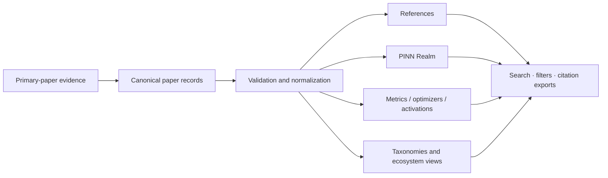

<p align="center">
  
</p>

<h1 align="center">PINN Review Atlas</h1>

<p align="center">
  <strong>An evidence-led, interactive research companion for Physics-Informed Neural Networks.</strong><br>
  Explore the review corpus paper by paper, compare reported methods and evaluation practices, inspect geographic patterns, and trace every Atlas view back to its source evidence.
</p>

<p align="center">
  <a href="https://ahafuaej-alt.github.io/PINN-Review/"></a>
  <a href="https://ahafuaej-alt.github.io/PINN-Review/references/"></a>
</p>

<p align="center">
  <a href="https://ahafuaej-alt.github.io/PINN-Review/references/">References</a> ·
  <a href="https://ahafuaej-alt.github.io/PINN-Review/pinn-realm/">PINN Realm</a> ·
  <a href="https://ahafuaej-alt.github.io/PINN-Review/performance-metrics/">Performance Metrics</a> ·
  <a href="https://ahafuaej-alt.github.io/PINN-Review/pinn-ecosystem/">PINN Ecosystem</a> ·
  <a href="https://ahafuaej-alt.github.io/PINN-Review/cite/">Citation Guide</a>
</p>

---

## About the Atlas

**PINN Review Atlas** is the web companion to a comprehensive review of Physics-Informed Neural Networks (PINNs). It turns the review evidence base into a navigable research resource rather than leaving the literature synthesis only in static manuscript tables and figures.

The Atlas is designed for researchers who want to answer questions such as:

- Which PINN methods, optimizers, activation functions, and evaluation metrics are actually reported in the literature?
- Which papers support a specific methodological statement or classification?
- How is PINN research distributed geographically, and where does international co-authorship occur?
- How complete is performance reporting across the literature?
- How do the many elements of a PINN interact as one coupled numerical-learning system?
- How can a specific evidence subset, configuration, or reference search be shared or exported reproducibly?

The core principle is simple: **the visualization layer may evolve, but the evidence trail must remain inspectable.**

## Explore the Atlas

| Atlas module | Status | What it provides |
|---|---|---|
| **[Review References](https://ahafuaej-alt.github.io/PINN-Review/references/)** | **Live** | Complete 853-record bibliography with advanced search, filters, reading lists, shareable URLs, bibliography analytics, and citation exports. |
| **[PINN Realm](https://ahafuaej-alt.github.io/PINN-Review/pinn-realm/)** | **Live** | Interactive geographic analysis of the 853-paper corpus, including country publication patterns, international affiliation co-occurrence, annual profiles, collaboration volume, and Jaccard intensity. |
| **[Performance Metrics](https://ahafuaej-alt.github.io/PINN-Review/performance-metrics/)** | **Live** | Paper-level reporting of accuracy, physics, robustness, efficiency, uncertainty, and related metrics using a 123-metric taxonomy. |
| **[Optimizers](https://ahafuaej-alt.github.io/PINN-Review/optimizers/)** | **Live** | Paper-level optimizer and training/inference-algorithm evidence with raw source wording, conservative normalization, families, prevalence views, and comparison tools. |
| **[Activation Functions](https://ahafuaej-alt.github.io/PINN-Review/activation-functions/)** | **Live** | Activation-function evidence, adaptive variants, layer roles, source context, reporting completeness, and normalized families. |
| **[Abbreviations](https://ahafuaej-alt.github.io/PINN-Review/abbreviations/)** | **Live** | Exact reported PINN-related abbreviations, frequencies, and traceability to supporting reference IDs. |
| **[PINN Ecosystem & Design Studio](https://ahafuaej-alt.github.io/PINN-Review/pinn-ecosystem/)** | **Live** | A nine-layer, 35-group design ontology with explicit relationships plus an interactive PINN builder, compatibility signals, live architecture flowchart, SVG export, and shareable configurations. |
| **[Dataset Manager](https://ahafuaej-alt.github.io/PINN-Review/dataset-manager/)** | **Live** | Evidence-backed correction workflow for canonical paper records with impact preview, MDPI citation generation, validation, and auditable GitHub submission. |
| **[PINN Types](https://ahafuaej-alt.github.io/PINN-Review/pinn-types/)** | **Prepared workspace** | Classification, frequency, profile, and evidence routes prepared for the validated PINN-type dataset. |
| **Architectures · Training · Applications · Software · Datasets** | **Prepared structure** | Stable section architecture is in place; specialized data views will be published after the corresponding records are validated. |

> **Status matters.** The Atlas intentionally distinguishes fully populated evidence explorers from prepared workspaces. A structured page is not presented as a completed dataset.

## Research data at a glance

The Atlas uses the review's numeric **paper/reference ID as the stable primary key**. Sorting, filtering, metadata corrections, or new derived views do not renumber the evidence base.

Current public data include:

- **853** canonical paper records
- **63** standardized country names represented in PINN Realm
- **123** normalized performance metrics
- **53** canonical optimizer/training-algorithm forms
- **62** canonical activation-function entries
- **501** distinct reported abbreviation forms traced across **618** reference records
- **9** dependent PINN design layers and **35** methodological groups in the PINN Ecosystem

For the current machine-readable bibliography metadata, see [`data/references-metadata.json`](data/references-metadata.json).

## Evidence architecture

The public views are generated from explicit evidence records rather than maintained as independent hand-edited totals.



The canonical bibliography record is [`data/papers-master.json`](data/papers-master.json), with schema and validation logic kept in the repository. Derived datasets and public interfaces are rebuilt from their authoritative sources so that corrections propagate consistently.

### Evidence principles

1. **Stable identity** — paper IDs remain fixed.
2. **Source traceability** — normalized labels retain links to raw wording or paper-level evidence wherever applicable.
3. **No silent guessing** — uncertain bibliographic or classification information is not filled merely to make a table look complete.
4. **Transparent normalization** — aliases, families, metrics, and methodological groupings are separated from source facts.
5. **Versioned correction** — material dataset changes are reviewable and auditable.
6. **Scientific restraint** — frequency of use is not interpreted as methodological superiority.

## Search, export, and reproducibility

The **References** workspace supports field-aware searching and filtering by year, access status, reference type, venue, author, DOI, and text. Selected records can be exported directly from the browser.

Available client-side citation/data exports include:

- BibTeX
- RIS
- EndNote-compatible output
- Zotero-compatible RIS
- CSV
- copied formatted citations

Other Atlas modules provide JSON, CSV, TXT, or SVG downloads where appropriate. Shareable URLs preserve focused searches or interactive states when the relevant module supports them.

### Machine-readable entry points

- [`data/papers-master.json`](data/papers-master.json) — canonical paper register
- [`data/references-metadata.json`](data/references-metadata.json) — bibliography metadata and dataset summary
- [`data/pinn-realm.json`](data/pinn-realm.json) — geographic evidence dataset
- [`data/pinn-ecosystem/pinn-ecosystem.json`](data/pinn-ecosystem/pinn-ecosystem.json) — PINN ecosystem taxonomy
- [`data/optimizers/optimizer-records.json`](data/optimizers/optimizer-records.json) — normalized optimizer evidence
- [`data/activation-functions/activation-records.json`](data/activation-functions/activation-records.json) — normalized activation-function evidence

## Scientific interpretation

The Atlas is an **evidence exploration and synthesis resource**, not a leaderboard.

A method appearing frequently in the literature does not establish that it is universally preferable. Likewise, two papers reporting the same metric name are not necessarily directly comparable: governing equations, variable definitions, units, normalization, geometry, data regime, collocation strategy, architecture, optimizer settings, evaluation set, and computational budget may differ.

For this reason, Atlas comparison views preserve methodological context and use interpretation notices where a visual summary could otherwise imply more comparability than the evidence supports.

## Correct or extend the evidence

The Atlas is intended to remain reviewable.

### Bibliographic or paper-record correction

Use the **[Dataset Manager](https://ahafuaej-alt.github.io/PINN-Review/dataset-manager/)** to select a paper, prepare an evidence-backed correction, preview downstream impact, and open a visible GitHub update request.

You can also open the structured **[reference-correction issue form](https://github.com/ahafuaej-alt/PINN-Review/issues/new?template=reference-correction.yml)** directly.

### PINN Ecosystem proposal

If a methodological element or relationship is missing, use **[PINN Ecosystem](https://ahafuaej-alt.github.io/PINN-Review/pinn-ecosystem/)** → **Propose a missing item**. Proposals remain public and reviewable before the curated taxonomy changes.

For other repository-level questions, use **[GitHub Issues](https://github.com/ahafuaej-alt/PINN-Review/issues)**.

## Citation

Use the **[Atlas citation guide](https://ahafuaej-alt.github.io/PINN-Review/cite/)** and cite the **narrowest relevant Atlas view**, not only the home page. For reproducible academic use, record the page URL together with the access date and, when a submitted manuscript depends on a specific state of the Atlas, the corresponding release or commit identifier.

Formal manuscript authorship and archival citation metadata will be added to the citation page when finalized.

## Privacy

The Atlas has no reader accounts or first-party profile database. Browser storage is used only for optional conveniences such as theme preference, selected references, and recent bibliography searches. Aggregate reach statistics, when active, are handled through GoatCounter and are kept separate from the scientific evidence base.

See the **[Privacy page](https://ahafuaej-alt.github.io/PINN-Review/privacy/)** for the complete policy.

## Local preview

The Atlas is a static GitHub Pages site and does not require a framework build for ordinary local browsing.

```bash
python3 -m http.server 8000
```

Then open:

```text
http://localhost:8000
```

Running a local HTTP server is recommended instead of opening the HTML files directly because several Atlas modules load JSON and other assets through browser requests.

## Repository map

```text
PINN-Review/
├── index.html                 # Atlas home page
├── references/                # 853-paper bibliography and changelog
├── pinn-realm/                # Geographic and collaboration analysis
├── performance-metrics/       # Performance evidence explorer
├── optimizers/                # Optimizer evidence explorer
├── activation-functions/      # Activation-function evidence explorer
├── abbreviations/             # Terminology evidence index
├── pinn-ecosystem/            # Ecosystem ontology and Design Studio
├── dataset-manager/           # Evidence-backed dataset correction interface
├── architectures/             # Prepared research workspace
├── training/                  # Prepared research workspace
├── applications/              # Prepared research workspace
├── software/                  # Prepared research workspace
├── datasets/                  # Prepared research workspace
├── cite/                      # Citation guidance
├── privacy/                   # Privacy and analytics policy
├── data/                      # Canonical and derived research datasets
├── assets/                    # Shared UI, scripts, styles, and visual assets
└── .github/                   # Issue forms and repository automation
```

<details>
<summary><strong>Maintainer notes</strong></summary>

### Publishing

The repository is deployed to GitHub Pages from `main` through the Pages workflow in `.github/workflows/pages.yml`.

### Canonical-data maintenance

Paper-level corrections should normally enter through the Dataset Manager and validated GitHub workflow rather than through manual edits to derived data files. This protects cross-view consistency and the audit trail.

The public bibliography changelog and data-quality policy are available at **[References → Changelog & data quality](https://ahafuaej-alt.github.io/PINN-Review/references/changelog/)**.

</details>

---

<p align="center">
  <strong>PINN Review Atlas</strong><br>
  Evidence-led · Versioned · Built for inspection, synthesis, and reproducible research
</p>
