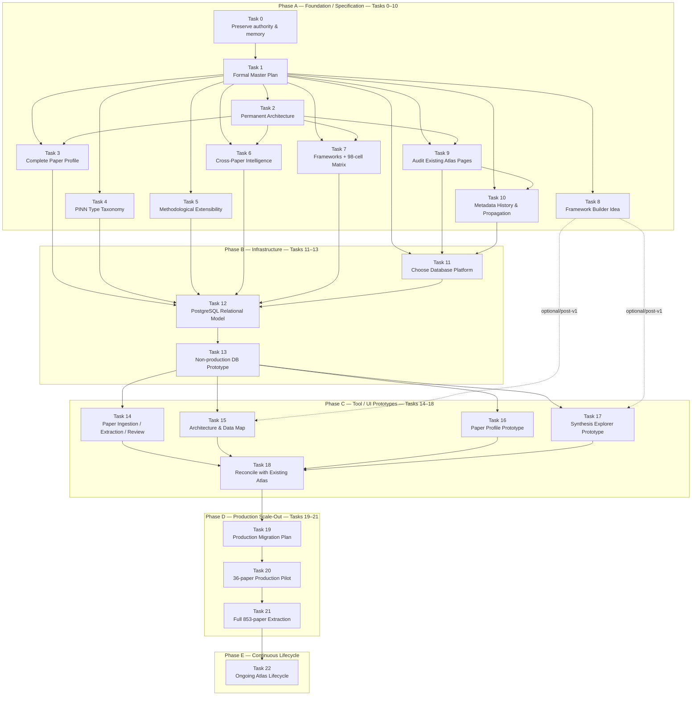

# PINN Review Atlas — Master Roadmap Visual

This page is the visual companion to [`CONTROLLED-ROADMAP.md`](./CONTROLLED-ROADMAP.md). It is documentation-only and does not authorize production changes.

## How to read this

1. **Task 1 is the current next substantive task.**
2. Tasks 2–10 develop and audit the scientific/architectural contract before infrastructure is selected.
3. Tasks 11–13 select and prove the database architecture in isolation.
4. Tasks 14–18 build controlled tools and UI prototypes and reconcile them against the existing Atlas.
5. Tasks 19–21 govern production migration and scientific scale-out.
6. Task 22 is permanent lifecycle work.

## Detailed hierarchy

For every Task N and Task N.x instruction, use [`CONTROLLED-ROADMAP.md`](./CONTROLLED-ROADMAP.md). The raw Mermaid source is also retained in [`roadmap-flow.mmd`](./roadmap-flow.mmd) so other tooling can reuse it.
